# Ali Ahmad

**BS Data Science & AI — FAST NUCES, Lahore**  
Building end-to-end machine learning systems, data pipelines, and backend-driven applications.

[LinkedIn](https://linkedin.com/in/whozahm3d) • [Linktree](https://linktr.ee/whozahm3d) • [GitHub](https://github.com/whozahm3d)

---

## Profile Summary

Data Science undergraduate with hands-on experience building deployable AI systems across fraud detection, computer vision, NLP, and data engineering. I focus on evaluation rigor, clean architecture, and solutions that work in real scenarios — not just in notebooks.

---

## Core Skills

| Domain | Technologies |
|---|---|
| **Languages** | Python, C++, C#, SQL |
| **ML / AI** | Scikit-learn, PyTorch, XGBoost, NLP, LLMs, RAG, PEFT, SHAP, Prompt Engineering |
| **Data Engineering** | Pandas, PostgreSQL, SQL Server, ETL Pipelines, Data Warehousing, Power BI |
| **Backend & Tools** | Streamlit, .NET, Jupyter, VS Code, Git |
| **Cloud** | AWS, Microsoft Azure |

---

## What I Have Done

- Built ML pipelines for fraud detection, recommendation, and forecasting with measurable evaluation metrics
- Developed backend and database-driven systems handling authentication, workflows, and structured data
- Designed ETL pipelines, data warehouse schemas, and Power BI dashboards for business reporting
- Integrated LLM-based features including RAG systems, PEFT fine-tuning, and prompt engineering

## How I Work

**Problem understanding → data preparation → model or system design → implementation → evaluation → delivery**

I focus on solutions that are not only technically correct but also reproducible, maintainable, and useful in real scenarios.

---

## Project Areas

- **Applied AI & ML Products:** Fraud detection, recommendation, and forecasting systems built with rigorous evaluation (AUPRC, recall, SHAP explainability) and deployed via Streamlit or HuggingFace.
- **Data Engineering & Analytics:** ETL workflows, star-schema warehouse designs, and reporting layers that turn raw transactional data into actionable dashboards.
- **Backend & Database Systems:** Structured backend logic, authentication flows, admin approval pipelines, and SQL-backed application features.
- **End-to-End Prototyping:** From concept to deployable demo with clear documentation, modular code, and maintainable architecture.

---

## Selected Projects

| Project | What I Built | Stack | Highlights |
|---|---|---|---|
| **[TrustGuard AI](https://github.com/whozahm3d/trustguard-ai-fraud-detection)** | Fraud detection pipeline on PaySim with explainable outputs and regulatory grounding | Python, XGBoost, PyTorch, RAG, ChromaDB | 4 models, SMOTE for 0.13% class imbalance, SHAP explainability, RAG grounded in SBP regulations, deployed on Streamlit |
| **[PEFT Comparative Study](https://github.com/whozahm3d/efficiency-vs-performance-peft-research)** | Parameter-efficient fine-tuning analysis across multiple LLM adaptation methods | Python, PyTorch, HuggingFace, PEFT | LoRA-based tuning pipelines, multi-seed statistical evaluation, McNemar significance testing |
| **[Time Series Data Analysis & Trend Discovery in Pakistan Crop Prices](https://github.com/whozahm3d/pk-crop-prices-analysis-and-trend-discovery)** | End-to-end time-series forecasting and anomaly detection on 53 CSVs | Python, Pandas, Scikit-learn | 9 models benchmarked; Linear Regression ranked first by RMSE; lag_1 identified as dominant universal predictor |
| **[Harris-LK Object Tracker](https://github.com/whozahm3d/harris-lk-vehicle-tracker)** | Classical single-object tracker combining corner detection and optical flow | Python, OpenCV, NumPy | Harris + pyramidal LK, forward-backward error filtering, adaptive redetection; 54-page technical report |
| **[Movie Recommendation System](https://github.com/whozahm3d/MovieRecommendationSystem)** | Hybrid recommendation app with interactive interface | Python, Streamlit, Scikit-learn | Content-based + collaborative filtering via cosine similarity |
| **[E-Commerce Data Warehouse & Analytics](https://github.com/whozahm3d/E-Commerce-Data-Warehouse-Power-BI-Analytics-Dashboard)** | Reporting and analytics solution for business insights | PostgreSQL, Power BI | Star schema design, ETL from raw transactional data, Power BI dashboards |
| **[Mock Examination System](https://github.com/whozahm3d/MockExaminationApp)** | Digital mock-test platform with structured exam workflows | Python, SQL | Timed attempts, scoring engine, result reporting, SQL-backed schema |
| **[Unused Medicine Donation System](https://github.com/whozahm3d/Online-Unused-Medicine-Donation)** | Full-stack platform for medicine donation and request workflows | C#, .NET, SQL | Auth, admin approval pipeline, donor-recipient matching |

---

## Certifications

**Specializations**

| Certificate | Issuer | Date |
|---|---|---|
| [Prompt Engineering Specialization](https://coursera.org/verify/specialization/3SNOMT7IMMZL) | Vanderbilt University | Aug 2025 |
| [Generative AI Assistants Specialization](https://coursera.org/verify/specialization/S7VFUZT5EYW8) | Vanderbilt University | Aug 2025 |
| [Google AI Essentials](https://coursera.org/verify/specialization/KRQ3HQH3Y8EU) | Google | Jul 2025 |
| [Google Prompting Essentials](https://coursera.org/verify/specialization/X8MUHAB34YY2) | Google | Jul 2025 |
| [Generative AI for Educators](https://coursera.org/verify/specialization/NT1WGRLPZRBK) | IBM | Jul 2025 |

<b>Individual Courses (5)</b>

| Certificate | Issuer | Date |
|---|---|---|
| [Working with the OpenAI API](https://www.datacamp.com) | DataCamp | Nov 2025 |
| [Prompt Engineering with the OpenAI API](https://www.datacamp.com) | DataCamp | Nov 2025 |
| [Feature Engineering for ML in Python](https://www.datacamp.com) | DataCamp | Oct 2025 |
| [Introduction to Deep Learning with PyTorch](https://www.datacamp.com) | DataCamp | Oct 2025 |
| [AI For Everyone](https://coursera.org/verify/HXWVU76FUSS7) | DeepLearning.AI | Jul 2025 |

---

## GitHub Activity

<!-- Static SVGs auto-generated every 12 hours via GitHub Actions — always loads instantly -->

  

  

  

---

## Topics

---

## Pinned Repositories
|  |  |
|  |  |

---

## Connect

[GitHub](https://github.com/whozahm3d) • [LinkedIn](https://linkedin.com/in/whozahm3d) • [X](https://x.com/whozahm3d) • [Instagram](https://instagram.com/whozahm3d) • [Linktree](https://linktr.ee/whozahm3d)

---

<i>"The gap between an idea and a working system is where I live."</i>

